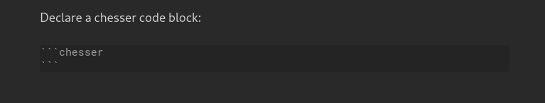

# Chesser Born Again

An improved chess game viewer/editor for [Obsidian](https://obsidian.md/) based on [SilentVoid13/Chesser](https://github.com/SilentVoid13/Chesser) with persisted game history and mobile support

## Demonstration

## Usage

To use [Chesser Born Again](https://github.com/caiorcferrera/chesser-born-again), you first need to declare a `chess` code block like so:

This will create a basic chess board in the start position.

You can declare various settings **inside** the `chess` code block, like a [FEN](https://en.wikipedia.org/wiki/Forsyth%E2%80%93Edwards_Notation) string to describe a particular board position. You can find the full settings list below.

## Settings

Here are the available settings for a `chess` code block:

| Name          | Possible Values                                              | Description                                                  |
| ------------- | ------------------------------------------------------------ | ------------------------------------------------------------ |
| `fen`         | A valid FEN string                                           | Starts the chess board with a particular position.           |
| `orientation` | `white`/`black`                                              | Orientation of the board.                                    |
| `pieceStyle`  | A valid piece style name. Check [this](https://github.com/SilentVoid13/Chesser/tree/master/assets/piece-css) to view available styles. | Style of the pieces on the board.                            |
| `boardStyle`  | A valid board style name. Check [this](https://github.com/SilentVoid13/Chesser/tree/master/assets/board-css) to view available styles. | Style of the chess board.                                    |
| `drawable`    | `true`/`false`                                               | Controls the ability to draw annotations (arrows, circles) on the board. |
| `viewOnly`    | `true`/`false`                                               | If enabled, displays a static chess board (no moves, annotations, ...). |
| `free`        | `true`/`false`                                               | If enabled, disables the chess logic, all moves are valid.   |

You can permanently set some settings in [Chesser Board Again](https://github.com/caiorcferreira/chesser-born-again)'s obsidian plugin settings.

## TODO

- [ ] Add [PGN](https://en.wikipedia.org/wiki/Portable_Game_Notation) format support

## Installation

After disabling Safe Mode, you can find third-party plugins in Settings > Community plugins > Browse > Search for "Chesser Born Again".

After installing, you can then find the installed plugins under Settings > Community plugins. They need to be enabled in order to take effect. You can also uninstall them there.

## Alternatives

- [SilentVoid13/Chesser](https://github.com/SilentVoid13/Chesser)
- [THeK3nger/obsidian-chessboard](https://github.com/THeK3nger/obsidian-chessboard)

## Contributing

Feel free to contribute.

You can create an [issue](https://github.com/SilentVoid13/Chesser/issues) to report a bug, suggest an improvement for this plugin, etc.

You can make a [pull request](https://github.com/SilentVoid13/Chesser/pulls) to contribute to this plugin development.

## License

[Chesser Born Again](https://github.com/caiorcferrera/chesser-born-again) is licensed under the GNU AGPLv3 license. Refer to [LICENSE](https://github.com/SilentVoid13/Chesser/blob/master/LICENSE.TXT) for more informations.

